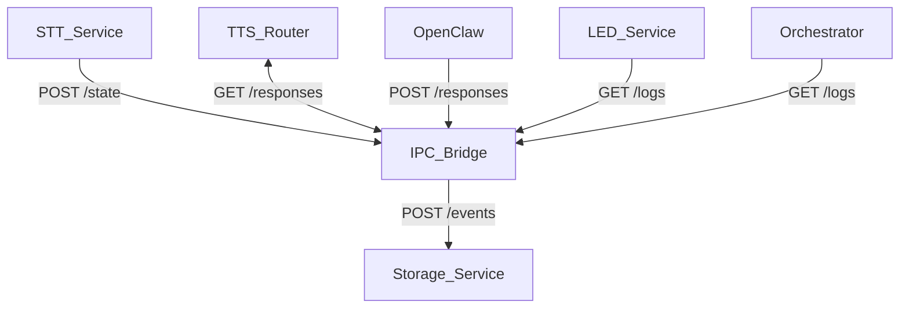

# RoboDevil Assistant

Node.js-first architecture and implementation scaffolding for the Raspberry Pi
assistant. This repo contains concrete specs for IPC, state management, service
contracts, TTS routing, process supervision, and testing.

## Structure
- `docs/ipc.md` — IPC message schema, state transitions, timeouts.
- `docs/service-contracts.md` — Service responsibilities and event contracts.
- `docs/tts-policy.md` — Self-governing TTS routing + fallback rules.
- `docs/pm2-systemd.md` — pm2 ecosystem + systemd startup plan.
- `docs/test-plan.md` — Closed-loop integration + failure tests.
- `config/config.schema.json` — Central config schema for thresholds and providers.
- `services/` — Service packages (STT, TTS router, LED, orchestrator, storage, ipc-bridge).
- `package.json` — Root workspace scripts and tooling.

## Notes
- The plan file is not modified during implementation.
- Trello cards are captured in the plan doc; this repo focuses on the build spec.

## IPC Data Flow

