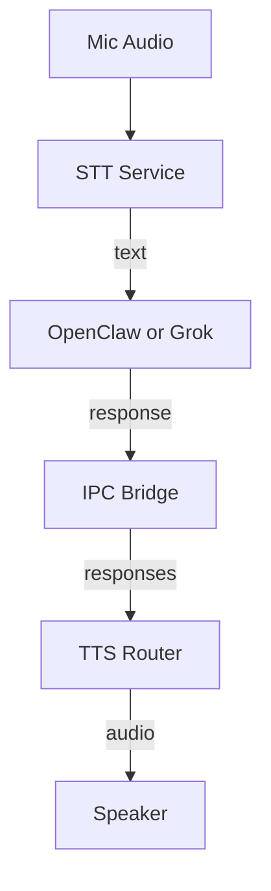
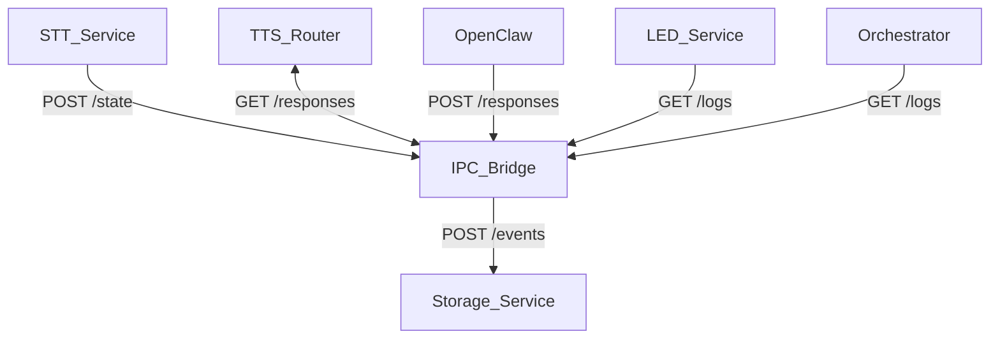

# RoboDevil Assistant

A voice-first extension for OpenClaw that turns a Raspberry Pi (or Mac) into a
demonic-but-helpful home assistant. RoboDevil wires local STT, OpenClaw/Grok,
and flexible TTS into a resilient, self-governing loop with explicit state
management and IPC.

If you want an assistant that is fast, local by default, and easy to run as a
set of services, this is it.

## Highlights
- **Voice-first**: Local STT (whisper.cpp) → LLM (OpenClaw or Grok) → TTS.
- **Interruptible**: Say “stop” to cancel playback immediately.
- **Self-governing**: Clear state machine with timeouts (`idle/listening/thinking/talking`).
- **Resilient**: IPC bridge + storage + watchdog orchestration.
- **Fun**: Demonic voice + LED panel personality hooks.

## Repo Structure
- `docs/ipc.md` — IPC message schema, state transitions, timeouts.
- `docs/service-contracts.md` — Service responsibilities and event contracts.
- `docs/tts-policy.md` — Self-governing TTS routing + fallback rules.
- `docs/pm2-systemd.md` — pm2 ecosystem + systemd startup plan.
- `docs/test-plan.md` — Closed-loop integration + failure tests.
- `config/app.config.json` — Non-secret runtime config (ports, STT/TTS defaults, LLM provider).
- `config/config.schema.json` — Config schema.
- `services/` — Service packages (STT, TTS router, LED, orchestrator, storage, ipc-bridge).
- `package.json` — Root workspace scripts and tooling.

## Quick Start (macOS)
Prereqs:
- `node` (see `.nvmrc`)
- `sox`
- `whisper.cpp` binary on PATH (Homebrew installs `whisper-cli`)

Install deps:
```bash
npm install
```

Copy secrets:
```bash
cp .env.example .env
```

Start services:
```bash
source .env
node scripts/dev.js
```

Start OpenClaw gateway (separate terminal):
```bash
openclaw gateway --port 18789
```

## Configuration

Non-secret runtime settings live in `config/app.config.json`. Secrets go in `.env`.

Copy `.env.example` to `.env` and adjust as needed (tokens + API keys):

```bash
cp .env.example .env
```

## OpenClaw Setup (macOS/Linux)

Run the setup helper:

```bash
npm run openclaw:setup
```

Then complete the interactive steps in your terminal:

```bash
openclaw setup
openclaw onboard --install-daemon
openclaw gateway --port 18789
```

OpenClaw uses its own API key store. If you rotate keys, re-run:

```bash
openclaw agents add main
```

## LLM Providers

The STT service can send prompts to either OpenClaw or xAI (Grok). Configure via
`config/app.config.json`:

```json
{
  "llm": {
    "provider": "openclaw",
    "model": "grok-4",
    "xai": { "baseUrl": "https://api.x.ai", "endpoint": "responses" }
  }
}
```

Set your xAI key in `.env` as `XAI_API_KEY` (or `GROK_API_KEY`).

## Wake Phrase

Set a wake phrase in `config/app.config.json`:

```json
{
  "stt": {
    "wakePhrase": "robodevil",
    "requireWake": true
  }
}
```

Restart `node scripts/dev.js` after changes.

## Voice Flow


## IPC Data Flow

## IPC Data Flow


