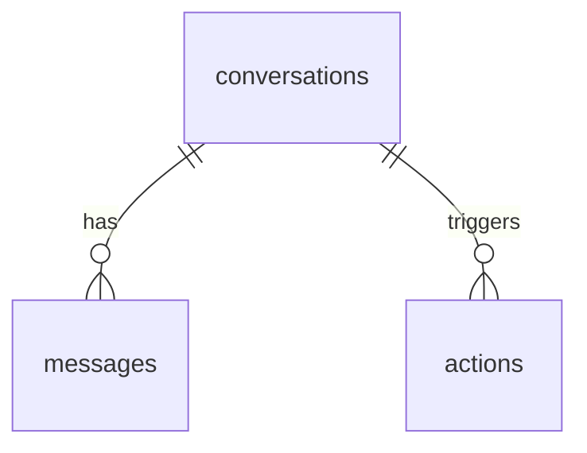

# Database Schema (Draft)

This is a minimal, evolving schema focused on logging and history. We can expand
as requirements solidify.

## Tables

### events
Generic event log (already implemented).
- `id` INTEGER PK
- `created_at` TEXT
- `type` TEXT
- `payload` TEXT (JSON)

### conversations
Tracks a conversation thread (voice session or WhatsApp session).
- `id` INTEGER PK
- `channel` TEXT (voice|whatsapp)
- `started_at` TEXT
- `ended_at` TEXT (nullable)
- `metadata` TEXT (JSON)

### messages
Stores user/assistant messages linked to a conversation.
- `id` INTEGER PK
- `conversation_id` INTEGER FK → conversations.id
- `role` TEXT (user|assistant|system)
- `content` TEXT
- `created_at` TEXT
- `metadata` TEXT (JSON)

### actions
Tracks actions taken by the assistant (e.g., light control, reminders).
- `id` INTEGER PK
- `conversation_id` INTEGER FK → conversations.id (nullable)
- `action_type` TEXT
- `status` TEXT (queued|success|failed)
- `created_at` TEXT
- `completed_at` TEXT (nullable)
- `metadata` TEXT (JSON)

## Notes
- Keep JSON in `metadata/payload` for flexibility.
- Index `created_at` fields once volume grows.

## Relationship Diagram

